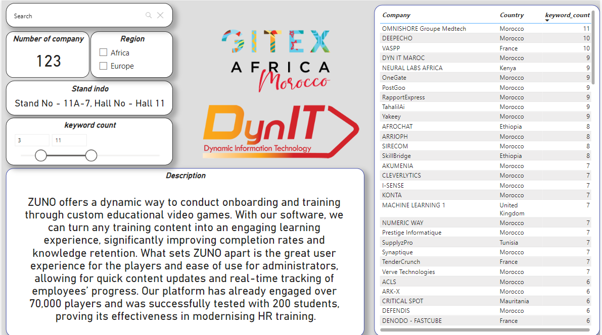

# **Gitex Company Scraper and Power BI Analysis**

## **Overview**
This project involves scraping data from the Gitex website to extract company profiles, performing data analysis and exploration, and creating a Power BI dashboard to visualize insights. The key steps include:

1. Extracting company names and details from the website using Python.
2. Normalizing the data for URL generation and extracting detailed information.
3. Performing exploratory data analysis (EDA) to understand company descriptions and identify key trends.
4. Analyzing the likelihood of companies integrating Microsoft's products and services based on specific keywords.
5. Visualizing insights in Power BI for better decision-making.

---

## **Features**
- **Web Scraping:** Automated extraction of company details from Gitex.
- **Data Cleaning & Normalization:** Preparing data for URL generation and downstream analysis.
- **EDA & Keyword Analysis:** Investigating company descriptions and keywords for strategic insights.
- **Microsoft Product Likelihood Analysis:** Calculating probabilities of companies adopting Microsoft's solutions.
- **Power BI Dashboard:** An interactive report for stakeholders to explore the data visually.

---

## **Folder Structure**
```plaintext
.
├── code/
│   ├── # Code for extracting company names from Gitex
│   ├── # Code for cleaning data and extracting detailed profiles
│   └── # Code for EDA and keyword-based likelihood analysis
├── data/
│   ├── # Extracted company data
│   ├── # Cleaned and detailed profiles
│   └── # Final dataset for Power BI
├── visuals/
│   ├── dashboard_preview.png         # Screenshot of the Power BI report
├── Gitex_Report.pbix                 # Power BI report file
└── README.md                         # Project documentation
```
---
## **Key Insights**
1. **Company Distribution**:
   - Total companies analyzed: 123.
   - Top regions: Africa and Europe.

2. **Keyword Analysis**:
   - Keywords with the highest frequency include "AI," "innovation," and "technology."
   - Likelihood of integrating Microsoft products is visualized using keyword matching.

3. **Stand Info**:
   - Key exhibition stands and halls highlighted for strategic planning.

4. **Descriptions**:
   - Rich descriptions provide insights into company offerings.
---
## **Power BI Dashboard**


You can either **download** the Power BI report file or **view** it online.

- **Download the Power BI report file**: [Download](https://github.com/hichambendaoud/Patient-record/blob/main/Patient_Records.pbix)

Explore the interactive dashboard on Power BI Service:  
[Power BI Dashboard](https://app.powerbi.com/links/TgY46y8QCm?ctid=3bd72a86-a8ea-44a6-a899-f3cccbedf027&pbi_source=linkShare)
